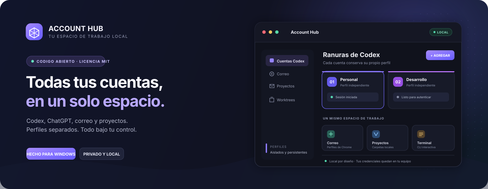
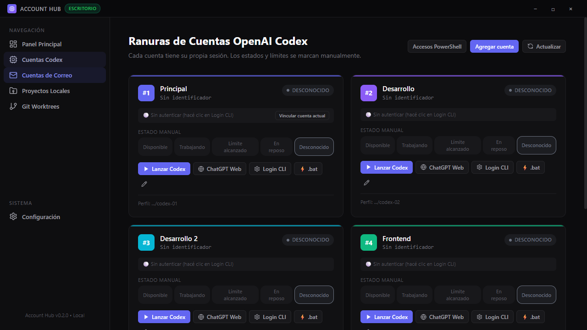
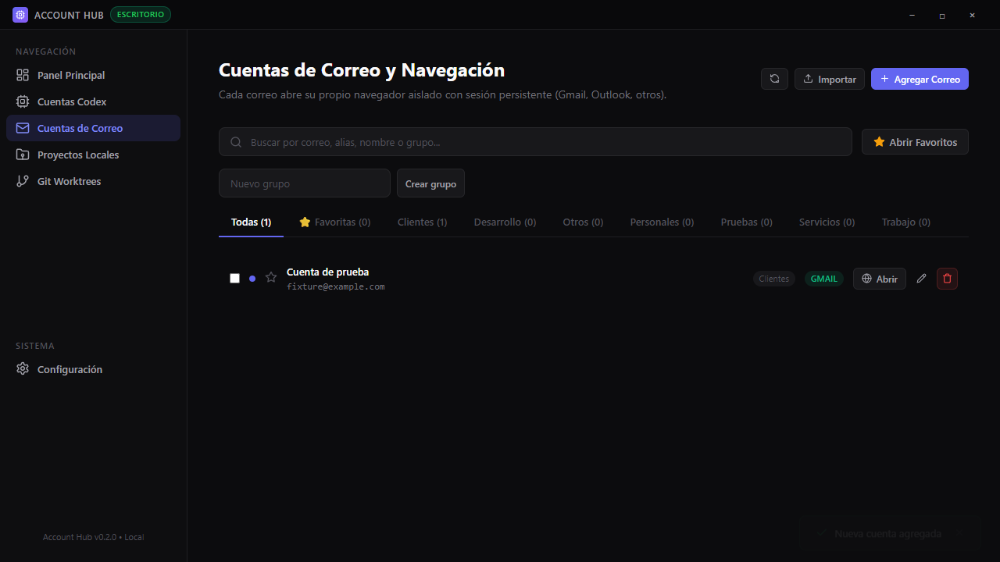

<h1 align="center">Account Hub</h1>

<div align="center">
  
  <br />
  <br />
  <a href="#instalar"></a>
  <a href="CONTRIBUTING.md"></a>
  <a href="LICENSE"></a>
  <br />
  <a href="#capturas"></a>
  <a href="SECURITY.md"></a>
  <br />
  <br />
  <strong>Codex · ChatGPT · Correo · Proyectos</strong>
  <br />
  Una aplicación local para mantener tus cuentas y tu trabajo organizados.
</div>

<p align="center">
  
  
  
</p>

---

## Todo en su lugar

Account Hub reúne varias cuentas de Codex y correo, los perfiles web de ChatGPT, tus proyectos locales y Git worktrees. Cada cuenta conserva su propio perfil y su propia sesión para que puedas cambiar de contexto desde una sola aplicación.

<table>
  <tr>
    <td width="50%"><strong>▣ Perfiles separados</strong><br />Un perfil Codex y un perfil de navegador por cuenta.</td>
    <td width="50%"><strong>⌘ CLI de verdad</strong><br />Lanzá el Codex CLI instalado en su terminal interactiva.</td>
  </tr>
  <tr>
    <td><strong>✉ Correo en Chrome o Edge</strong><br />Abrí cada buzón en su propio perfil persistente.</td>
    <td><strong>⑂ Proyectos y worktrees</strong><br />Organizá carpetas y ramas de trabajo por cuenta.</td>
  </tr>
</table>

### Capturas

<p align="center"><strong>Perfiles Codex</strong><br /><sub>Ranuras independientes con acceso directo al CLI.</sub></p>
<p align="center"></p>

<p align="center"><strong>Cuentas de correo</strong><br /><sub>Agregá, agrupá e iniciá cada perfil aislado del navegador.</sub></p>
<p align="center"></p>

<p align="center"><sub>Las capturas usan datos de prueba; no contienen cuentas personales.</sub></p>

<a id="instalar"></a>
## Empezar

### Requisitos

| Necesitás | Para qué |
| --- | --- |
| Windows x64 | Account Hub y sus integraciones locales |
| Node.js 22.12 o posterior + npm | Instalar dependencias y ejecutar el proyecto |
| Git y PowerShell | Terminales, proyectos y Git worktrees |
| Codex CLI oficial | Usar la integración Codex; se instala por separado |
| Chrome o Edge | Abrir perfiles de correo y ChatGPT |

### Instalar desde el código

En PowerShell, desde la carpeta del proyecto:

```powershell
npm ci
npm run dev
```

Esto inicia Account Hub como aplicación de escritorio. También podés ejecutar la interfaz web local:

```powershell
npm run web
```

Dejá abierta la terminal y entrá en [http://127.0.0.1:4173](http://127.0.0.1:4173) desde Chrome o Edge. La aplicación, su base de datos, la terminal y los procesos siguen funcionando en este equipo.

> [!IMPORTANT]
> La versión web solo escucha en `127.0.0.1`. No es un servicio para Internet, la red local ni múltiples usuarios.

### Iniciar sesión

- **Codex:** agregá una cuenta y elegí **Login CLI**. Account Hub ejecuta el CLI oficial con un perfil aislado para esa ranura.
- **ChatGPT y correo:** agregá la cuenta, abrí su perfil e iniciá sesión manualmente la primera vez. El navegador conserva esa sesión para las aperturas posteriores.

Las credenciales no se copian entre cuentas y las cookies de otros perfiles del navegador no se importan.

<a id="privacidad"></a>
## Privacidad, por diseño

Account Hub guarda los metadatos y perfiles en este equipo, bajo `%APPDATA%\AccountHub`. Las credenciales Codex y las sesiones de Chrome/Edge permanecen en sus respectivos perfiles; las copias exportadas no las incluyen.

La aplicación no cifra las credenciales con una clave propia: su protección depende de tu cuenta de Windows y del cifrado del disco. La terminal ejecuta con los permisos de Windows del usuario y no es un sandbox. Leé la [guía de seguridad](SECURITY.md) y el [diseño de privacidad](docs/security.md).

## Verificar y compilar

```powershell
npm run typecheck
npm test
npm run verify
```

`npm run verify` ejecuta las pruebas de servicios, IPC, SQLite, Git, terminal, Electron y web. Los datos de prueba se crean en `.audit/` y se excluyen del repositorio. Para generar y comprobar un instalador Windows:

```powershell
npm run build
npm run test:packaged
```

El instalador se escribe en `release/`. La firma de código no está configurada; Windows puede indicar que el editor es desconocido.

## Contribuir

¡Las mejoras y los reportes bien reproducidos son bienvenidos! Empezá por la [guía para contribuir](CONTRIBUTING.md). También podés leer el [código de conducta](CODE_OF_CONDUCT.md), reportar errores con las plantillas de GitHub o revisar la [política de vulnerabilidades](SECURITY.md).

Para los cambios de terminal, cuentas, perfiles, IPC, navegador y Git, seguí las reglas de aislamiento en [AGENTS.md](AGENTS.md).

## Documentación

| Guía | Contenido |
| --- | --- |
| [Arquitectura](docs/architecture.md) | Componentes y comunicación local |
| [Perfiles Codex](docs/codex-profiles.md) | `CODEX_HOME`, sesiones y terminales |
| [Perfiles de navegador](docs/browser-profiles.md) | Chrome, Edge y sesiones separadas |
| [Git worktrees](docs/git-worktrees.md) | Carpetas de trabajo aisladas |
| [Seguridad y privacidad](docs/security.md) | Límites, almacenamiento y protecciones |

---

<p align="center"><sub>Licencia <a href="LICENSE">MIT</a> · Proyecto independiente, no afiliado a OpenAI, Google ni Microsoft.</sub></p>
